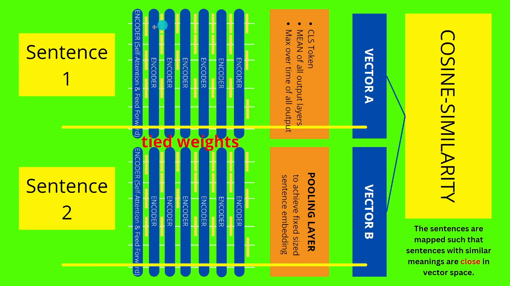

**General definitions and ideas**

    1. What is NLP (Natural Language Processing)?

    NLP is the branch of AI that gives computers the ability to read, understand, and derive meaning from human language. 
    
    In this project: We use NLP to bridge the gap between human language (messy invoices like "Used Dell Lptp 5400") and legal language (formal regulations like "Portable automatic data processing machines"). Traditional software only matches exact words; NLP matches the intent.

    2. What is Semantic Search?

    Search based on meaning, not just keywords. The difference:

    - Keyword Search (TF-IDF): Searching for "Apple" returns fruit.

    - Semantic Search: Searching for "Apple" returns "iPhone" because the model understands the context of technology. 
    
    In this project: We use it to match a product description to an HS Code even if they share zero common words (e.g., matching "Drone" to "Unmanned Aerial Vehicle").

    3. What is BERT?

    - The Definition: Bidirectional Encoder Representations from Transformers. The Breakthrough: Before BERT, computers read text left-to-right (like a human). BERT reads the entire sentence at once (left-to-right AND right-to-left). 
    
    - The Result: It understands context. It knows that "Bank" in "River Bank" is different from "Bank" in "Bank Account". 
    
    - The Limitation: BERT is incredibly accurate but slow for search. To find the most similar HS Code for one product, BERT would have to "read" every single HS Code pair one by one.

    4. Why SBERT (Sentence-BERT) over BERT?
    
    - The Problem with BERT: To compare 1 product against 10,000 HS codes, standard BERT requires 10,000 heavy neural network passes. This would take ~1 minute per product. 
    
    - The Solution (SBERT): SBERT modifies BERT to create Sentence Embeddings (fixed lists of numbers) that can be compared using simple math (Cosine Similarity). 
    
    - The Speedup: It reduces the computation from 10,000 Neural Network passes to 1 Neural Network pass + 10,000 dot products. 
    
    - The Impact: Search time drops from 60 seconds to 0.01 seconds.

**Part 1: Keyword Search / Vector-Based Fuzzy Matching**

    **TF-IDF** with character **n-grams** as a blocking mechanism was used. 

    Standard Levenshtein distance is **$O(N^2)$** and too slow for real-time screening against large sanctions lists. 

    By vectorizing the names into trigrams, we reduce the problem to a **matrix multiplication (Cosine Similarity)**, which takes fraction of second to match with even 1M+ rows master data. 

    This mirrors how search engines like Elasticsearch or SAP HANA Fuzzy Search handle large-scale text retrieval.

**Part 2: Semantic Search**

**S-BERT in a Siamese(Twin) Neural Network architecture:**

    We will use it to check if two sentences (Name of material in shipment and HS-Code) have the same meaning, for example:
    1. Used Lptp Dell Latitude 5450
    2. Automatic data processing machines (HS Code 8471)

